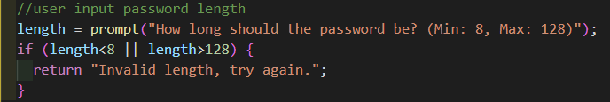
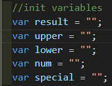
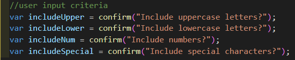
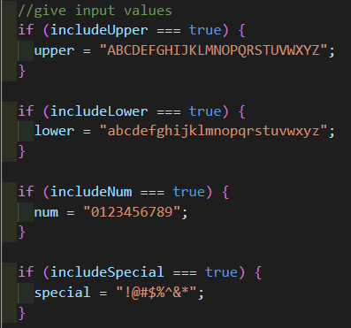
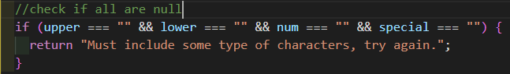
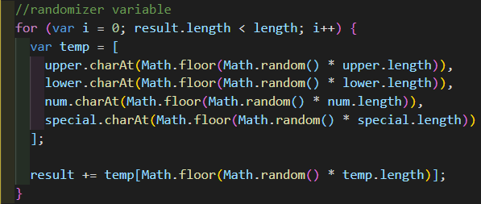

# JavaScript: Password Generator

1. User inputs password length with prompt.
2. Check if length is less than 8 or greater than 128.  

3. Declare variables to be used later.  

4. Get user input criteria.  

5. Give the input values.  

6. Check if all inputs are false.  

7. Randomize input criteria in for loop, and save to result variable.  

8. Return result and close function.  
