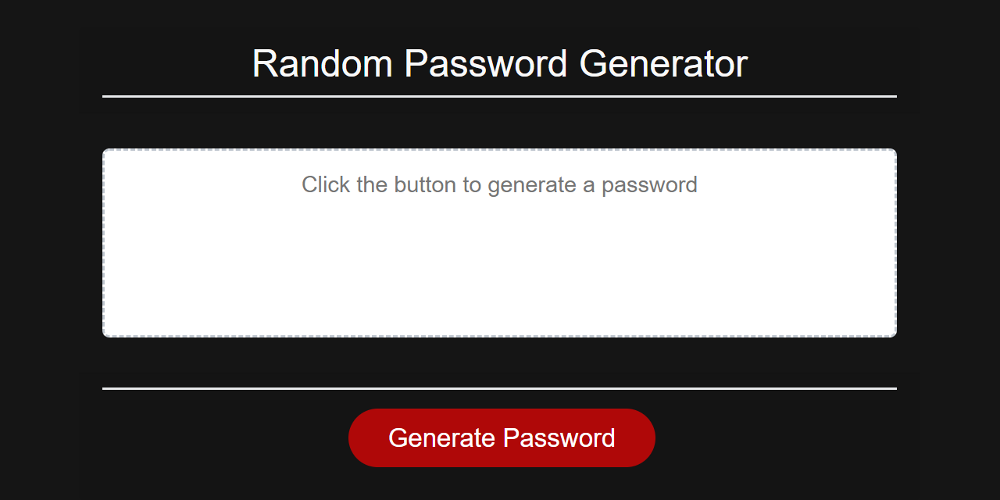

# Password Generator

## Description

A random password generator.

## Table of Contents

* [Installation](#installation)
* [Usage](#usage)
* [Credits](#credits)
* [License](#license)

## Installation

[Launch App](https://shiftymitch.github.io/portfolio/3/)

## Usage 

1. Open the application link above.
2. Click "Generate Password Button.
3. Answer pop up questions to design the password criteria.
4. Copy password and use as needed.

## Credits

[Mitch Henderson](https://shiftymitch.github.io/portfolio/2)

## License

## Contributing

No contributing necessary. Just clone the repo and make adjustments as needed.

## Questions

Questions can be directed via email to shiftymitch@gmail.com