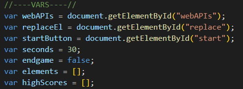
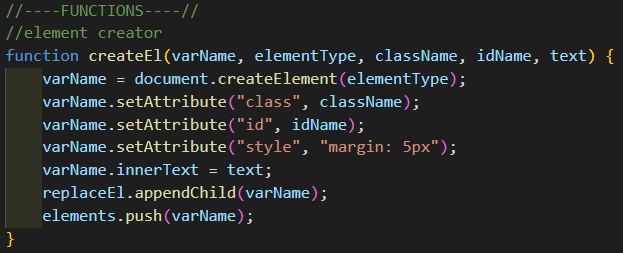
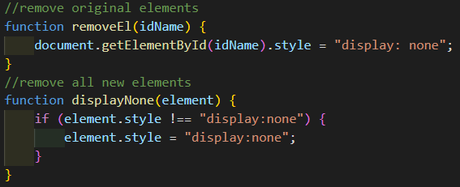
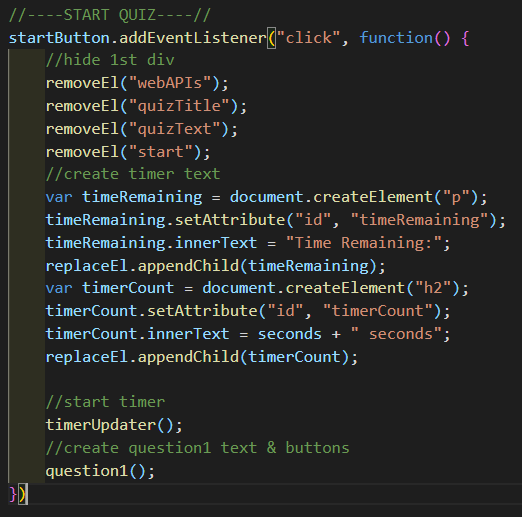
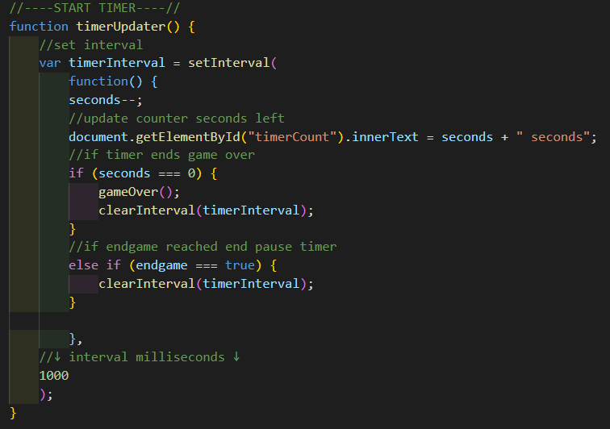
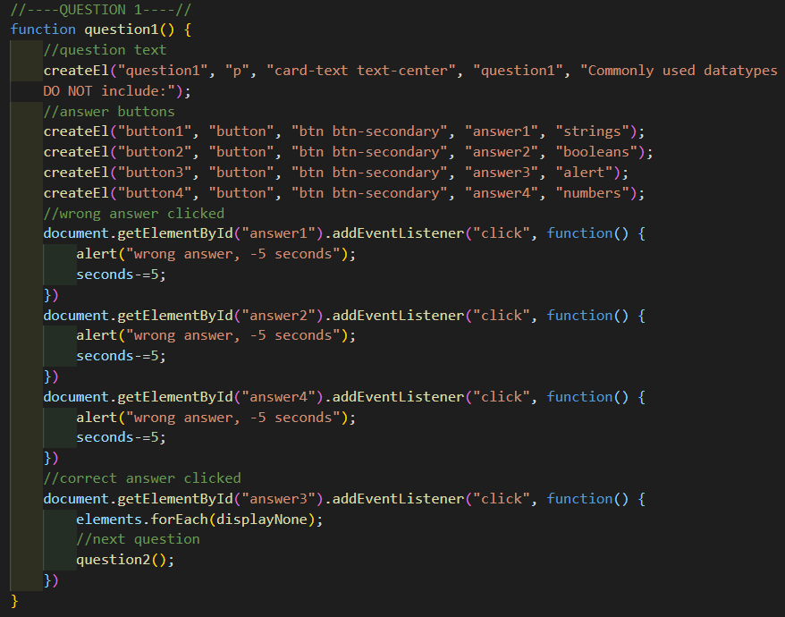
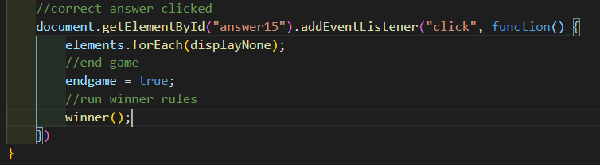
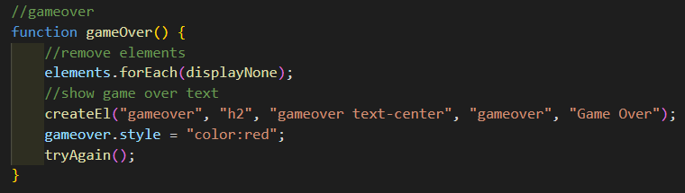
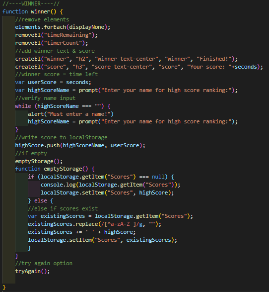
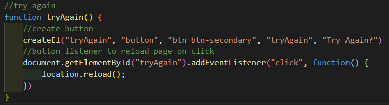

# JavaScript: Password Generator

1. Set Variables  

2. Element Creator  

3. Element Removers  

4. Start Quiz  

5. Start Timer  

6. Run Questions  

7. Final Question  

8. Game Over  

9. Winner  

10. Try Again  
