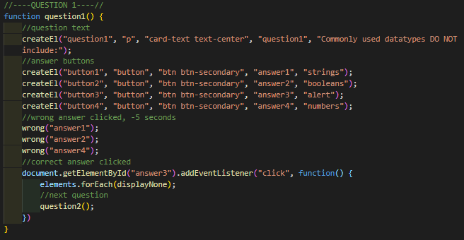

# WEB APIs: Coding Quiz Challenge

1. Set Variables  

2. Element Creator  

3. Element Removers  

4. Wrong Answer Clicked  

5. Start Quiz  

6. Start Timer  

7. Run Questions  

8. Final Question  

9. Game Over  

10. Winner  

11. Try Again  

12. High Scores Updater  
