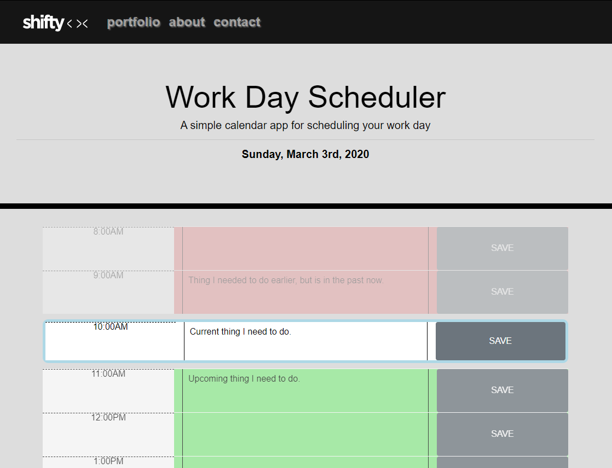

# Third-Party APIs: Work Day Scheduler

## Preview of finished app

1. Utilize moment.js for time formatting.
2. Utilize Jquery to build out time blocks.
3. Format time blocks based on past, present or future.
4. Save & retrieve inputs via localstorage.

[Try the deployed app: ](https://shiftymitch.github.io/assignments/5/)
