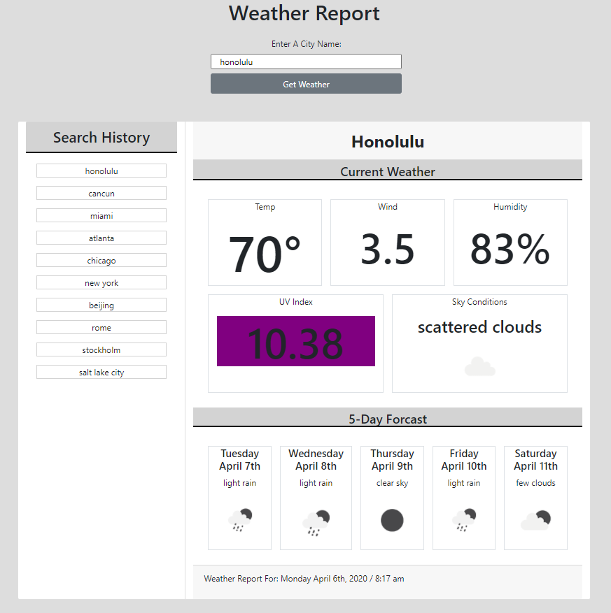
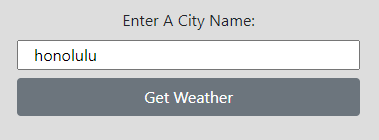
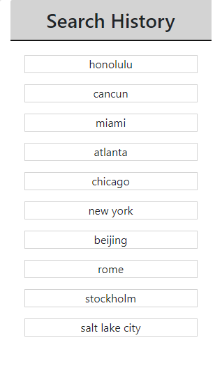
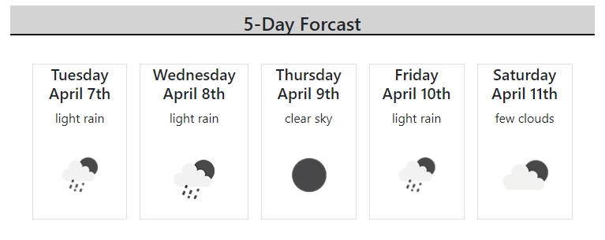
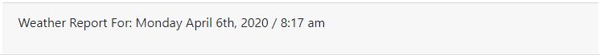

# Weather Dashboard - OpenWeatherMap API

 

## How it works:
1. Enter a city name in the input field and click "Get Weather" to see current weather data.  

2. Click a city from Search History panel to get an updated weather report for that city.  

3. Scroll to find 5-Day Forcast for the searched city.  

4. Footer shows date & time of weather data reported.  

## <a href="https://shiftymitch.github.com/assignments/6/">Click here to try it out!</a>